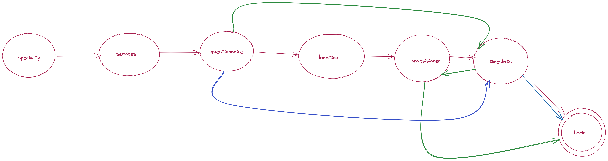

## POC to make DAGs for decision routing
This is a POC on how to create DAGs and use that to drive 
routing decisions

### How to build
You can use docker to build and test this locally.
See the Makefile for rules 

#### building and running
Use the following commands to build and run docker
```
make docker-build && make docker-run
```

Use Ctrl+C to end the container once testing is done

Use this to clean up post-testing
```
make docker-clean
```

#### Sample decision tree


The red arrows are Choice A

The blue is Choice B

and green is Choice C